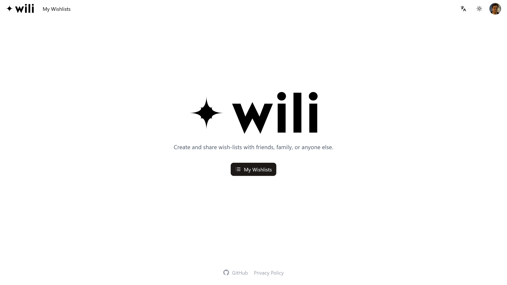
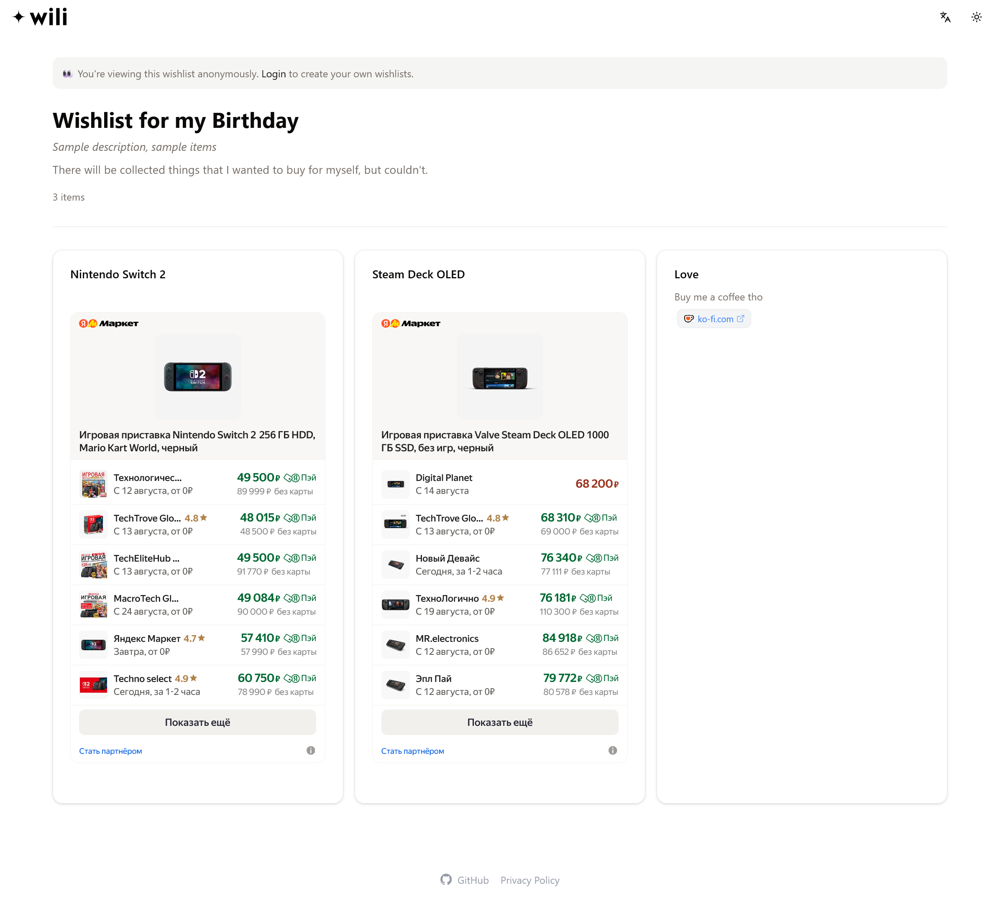
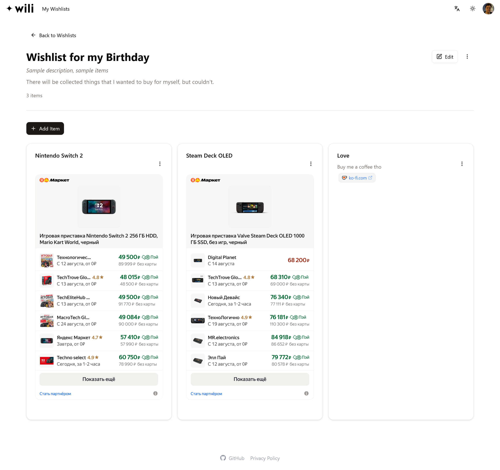

# Wili

Simplistic wishlist app to create and share lists of things you want.

## Screenshots





## Links

- [Wili website](https://wili.me)
- [Sample wishlist](https://wili.me/wishlists/dde3f5be-a611-490d-823e-a27c24dbc32e)


## Features

- Create and share wishlists
- Public wishlist pages
- Login with Yandex ID
- Clean, mobile‑friendly UI

## Tech

- Frontend: Svelte + TypeScript, Tailwind, shadcn‑svelte
- Backend: Go (microservices: user, wishlist)
- DB: Postgres (user), MongoDB (wishlist)
- OpenAPI for typed clients and servers

## Monorepo layout

```
backend/         # Go services (user, wishlist)
frontend/        # SvelteKit app
.github/         # CI/CD
```

## Getting started

### Quick Setup (Recommended)

Use the automated setup script for a complete development environment:

```bash
./scripts/setup-dev.sh
```

This will set up Podman containers for PostgreSQL and MongoDB, create databases, and generate `.env` files.

### Manual Setup

1) Frontend
- cd frontend
- pnpm install
- cp .env.example .env (adjust values)
- pnpm dev

2) Backend (local)
- Requires Postgres (user svc) and MongoDB (wishlist svc)
- Set env vars (e.g. DB, JWT_SECRET, YANDEX_CLIENT_ID/SECRET)
- cd backend/services/user && go run .
- cd backend/services/wishlist && go run .

## Generate API clients

From frontend/:
- pnpm run generate:api

---

Deployed with GitHub Actions to Yandex Cloud.

## AI assistance

Parts of this project were built with the help of AI coding tools to speed up development. All AI-suggested changes are reviewed and curated by the maintainer before merging.